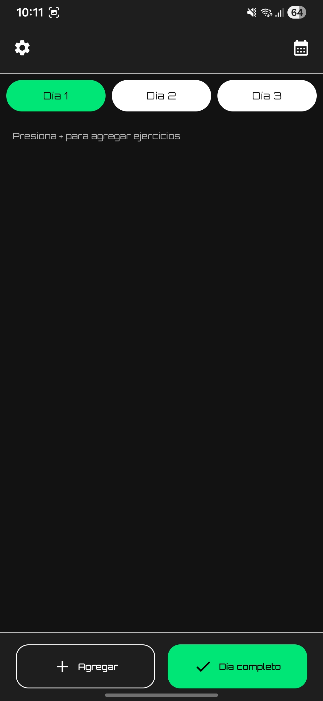
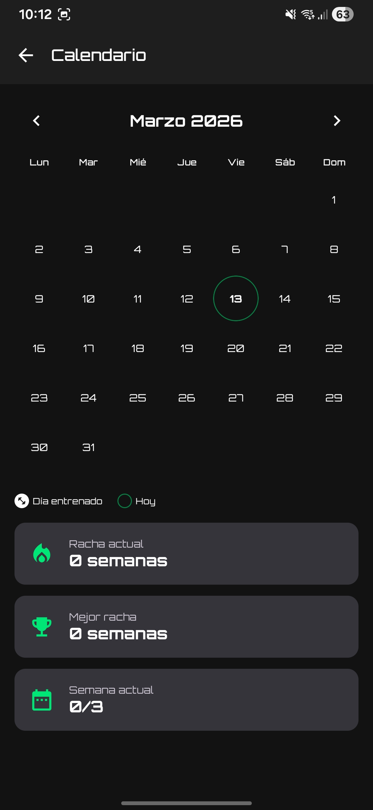
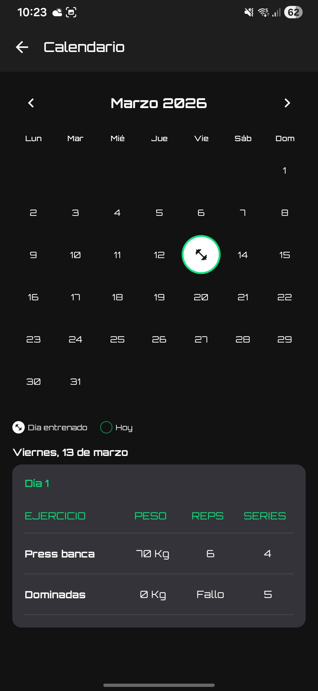
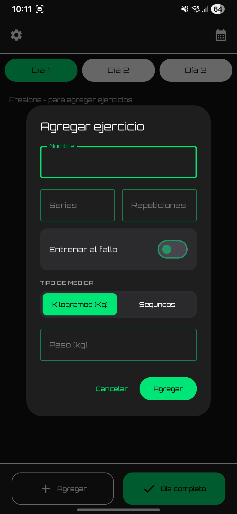
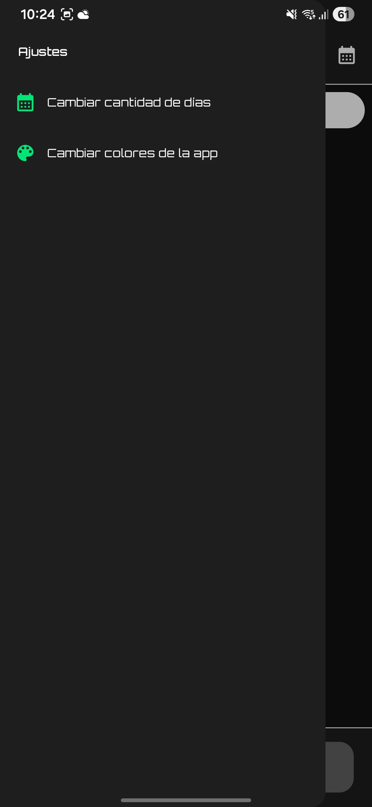
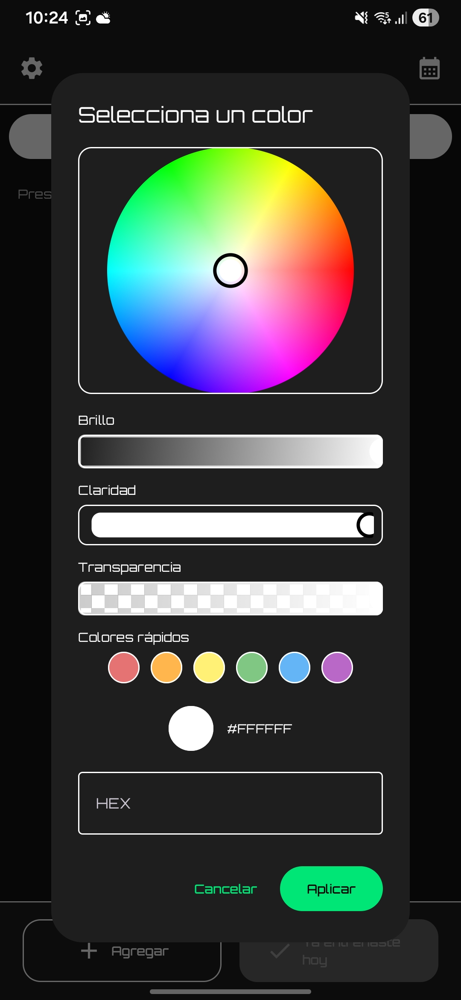

# My Routine App (Android)

Aplicación Android para crear y seguir rutinas de entrenamiento por días. Permite configurar la cantidad de días de la rutina, agregar ejercicios con series y repeticiones (incluyendo **al fallo**) y marcar el entrenamiento diario como completado para que el calendario refleje un único registro por día.  

---

## 🚀 Funcionalidades

- 📅 **Rutina por días** (configurable).  
- 💪 **Lista de ejercicios por día** con:  
  - Nombre  
  - Series  
  - Repeticiones  
  - Medida (valor y tipo)  
  - Opción **al fallo** (`failureValue = true` se muestra como `Fallo`)  
- 🔄 **Edición rápida** de ejercicios desde la tabla.  
- ↕️ **Reordenamiento** de ejercicios.  
- ❌ **Eliminación** de ejercicios.  
- ✅ **Botón `Día completo`**: registra un día de entrenamiento solo una vez (evita duplicados en el calendario).  
- 📆 **Calendario** para visualizar días entrenados.  
- ⚙️ **Ajustes**: cambio de días y personalización de tema/colores.  

---

## 📸 Capturas

## 📸 Capturas

<p align="center">
  
  
  
</p>

<p align="center">
  
  
  
</p>

---

## 🛠 Stack / Tecnologías

- Kotlin  
- Jetpack Compose (Material 3)  
- Gradle  
- Arquitectura **MVVM**  
- Hilt (inyección de dependencias)  

---

## ⚙️ Requisitos

- Android Studio **Meerkat Feature Drop | 2024.3.2 Patch 1** (o superior)  
- Android SDK instalado  
- JDK compatible con Android Studio  

---

## 📥 Instalación y ejecución

1. Clonar el repositorio:  
```bash
git clone https://github.com/FabriGonzalez/My-Routine-App-android.git
cd My-Routine-App-Android
```
2. Abrir el proyecto en **Android Studio**.

3. Sincronizar Gradle:  
```text
File > Sync Project with Gradle Files
```

4. Ejecutar la app:
- Seleccionar un dispositivo (emulador o físico).
- Presionar **Run** (Shift+F10).

## 🏋️ Uso

1. Al iniciar por primera vez, **configurar la cantidad de días de la rutina**.  
2. **Seleccionar un día** (Día 1, Día 2, etc.).  
3. **Presionar Agregar** para crear ejercicios.  
4. **Completar el entrenamiento** y **presionar Día completo** para registrar el día.  
5. **Abrir el calendario** para ver los días entrenados.
